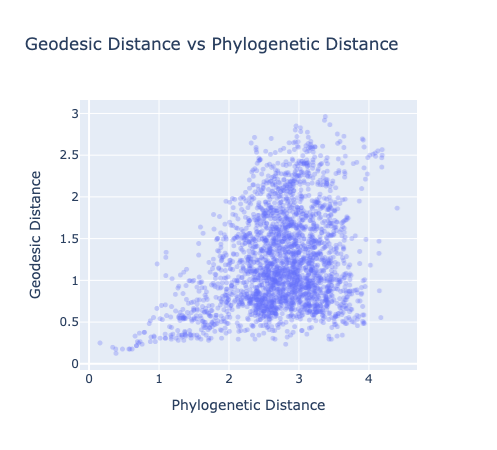
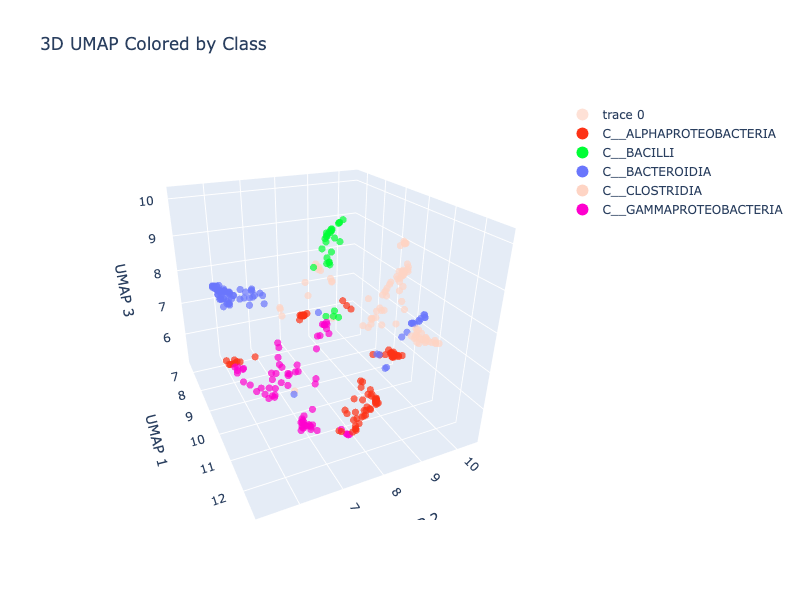

# (Re)Finding A Phylogenetic Manifold In Evo2

*A quick note before we start: this work was done in October 2025 as part of [ARENA 6.0](https://www.arena.education/)'s Capstone Week, and we never got around to writing it up at the time. We're publishing it now, ~5 months later, in the spirit of getting mostly-finished work out into the world rather than letting it sit forever on a hard drive. Some nuances may have been forgotten in this time, so don't take everything as gospel, although our overall takeaways that we were able to _roughly_ reproduce Goodfire's themes stand*

---

As part of [ARENA 6.0](https://www.arena.education/)'s Capstone Week, we set out to reproduce recent work by [Goodfire](https://www.goodfire.ai/) on [Finding the Tree of Life in Evo 2](https://www.goodfire.ai/research/phylogeny-manifold). We had 4.5 days and one L40S GPU.

[Evo 2](https://arcinstitute.org/tools/evo) is an autoregressive genomic foundation model trained by Arc Institute on over 9 trillion nucleotides of DNA and RNA sequence. Goodfire's experiments showed that Evo 2 encodes phylogenetic relationships geometrically in its embedding space — species that are evolutionarily close end up close in the model's internal representations, and you can find this structure by looking at distances along a curved manifold.

Our goals were:
1. Reproduce Goodfire's results in locating the phylogenetic manifold
2. Find another manifold in the embedding space with some semantic meaning (we didn't get to this)

Part 1 presents our results. Part 2 is field notes — a detailed account of how we actually got there, including the dead ends, so that others don't have to repeat our mistakes.

Our code is on [GitHub](https://github.com/jacobgreen/evo2-mech-interp). We also have embeddings saved (see [Reproduction Guide](#part-3-reproduction-guide)) — get in touch if you'd like access.

---

## Part 1: Results

### Dataset

We used 2458 bacterial species from the [GTDB v220](https://gtdb.ecogenomics.org/) database, loaded from the `arcinstitute/opengenome2` midtraining dataset on HuggingFace (chunks 1, 11, and 21). These are the same sequences used to train Evo 2. Goodfire only says they used "2400+ bacterial species from GTDB" — they don't specify which dataset or chunks, which turns out to matter (see Part 2).

Our 2458 species represent about **2.29% of the full GTDB tree** (~107k species). For context on coverage and the phylogenetic distance distribution across our dataset:


The distance distribution is roughly bell-shaped, peaking around 2–2.5, which suggests reasonable spread across phylogenetic space (though see Part 2 for caveats on how species were selected).

### Embedding Space Structure

Following Goodfire's approach, we extracted layer 24 activations from the Evo 2 7B model for each species. Goodfire specifies "layer 24 (of 32)" — since the 7B model has 32 layers and the 1B has fewer, we inferred they used the 7B, though they don't state this explicitly. For each genome we sampled multiple 4000bp regions covering ~5% of the genome, ran them through the model, and averaged the activations over the last 2000bp of each region (to give the model enough context before reading off the representation). We then averaged across regions to get a single embedding per species.

A 3D UMAP of these embeddings, coloured by bacterial class:


There is some clustering structure — you can see classes grouping loosely together — but it's fairly noisy. The raw embeddings capture a lot of information beyond phylogeny, and at 2458 species the UMAP is crowded.

### Phylogenetic Signal

The key question is whether distances in the embedding space track evolutionary distances from the GTDB phylogenetic tree.

**Cosine distance vs. phylogenetic distance:**


There's a weak linear relationship (Spearman ρ=0.105). Cosine distance doesn't scale linearly with phylogenetic distance, but it does tend to go up as phylogenetic distance increases — the signal is there, just nonlinear, and much noisier than what the original post was able to show.

**Geodesic distance vs. phylogenetic distance:**

Goodfire addressed the nonlinearity by building a K-nearest-neighbour graph (k=27, angular distance) and computing geodesic distances — shortest paths along the manifold. The idea is that locally-linear hops should preserve distance better than direct cosine distance.


We get a Pearson r=0.379 — a positive trend, but a broad mushroom-shaped scatter rather than a clean linear relationship. For comparison, the Goodfire post shows a much tighter trend. We discuss why below.

Earlier in the project, on a smaller intermediate run, the geodesic plot looked cleaner:



This hints that something degrades at scale — either the KNN graph quality, or the diversity of species in our larger sample.

### Flat Subspace

Goodfire found that the phylogenetic structure could be captured more cleanly by learning a low-dimensional linear projection that directly optimises for phylogenetic distance preservation. We implemented the same: a 10-dimensional encoder trained with a combined loss (angular distance prediction error + reconstruction error via the pseudoinverse).


Pearson r=0.504, Spearman ρ=0.395. Better than the raw geodesic, but still weaker than Goodfire's reported 0.98.

The more compelling result is the UMAP of the flat subspace:


This is noticeably cleaner than the raw embedding UMAP. Alphaproteobacteria (teal) separates out clearly at the top, Bacteroidia (purple) is isolated to the right, and other major classes form more distinct clusters. The flat subspace is doing something real — even if the quantitative correlation is weaker than we'd like. We were also hoping to see some sort of tree-like structure in this representation, which you can perhaps only see if you squint and tilt your head a bit...

Training converged well across all runs — total loss dropped from ~6 to ~1 over 100 epochs. One thing worth noting: the reconstruction loss was negligible throughout (hovering around 0.00243), meaning the distance loss almost entirely drove learning. The α reconstruction parameter effectively didn't constrain the encoder much, which may be worth tuning if you're building on this.

### Summary

| Metric | Our result | Goodfire |
|---|---|---|
| Cosine distance vs Phylo (Spearman) | ρ = 0.105 | ρ = 0.80 |
| Geodesic vs Phylo (Pearson) | r = 0.379 | r = 0.78 |
| Flat subspace vs Phylo (Pearson) | r = 0.504 | 0.98 |
| Flat subspace UMAP | clean class separation, less clear tree-like structure | qualitatively similar |

We reproduced the qualitative finding — the phylogenetic manifold is there, and the flat subspace makes it more visible — but our quantitative correlations are weaker. We have some ideas about why.

---

## Part 2: Field Notes

### Day 1–2: Getting the pipeline working

The first task was just getting embeddings out of Evo 2 and checking whether they had any structure at all.

The [Arc Institute notebook](https://github.com/ArcInstitute/evo2) for Evo 2 "barely works" in its out-of-the-box form — it's enough to load the model and run a forward pass, but extracting intermediate layer activations at scale required significant modification. We spent most of day 1 here.

Our first uncoloured UMAPs showed a branching, spread-out structure in 3D space — encouraging. Adding taxonomic colouring from GTDB showed clear clustering even at just 64 species:



Bacilli (green) clearly separated, Bacteroidia (blue) isolated, the Proteobacteria and Clostridia grouped together in the lower cluster. That was the "it's working" moment.

**Key early decision: midtraining vs. pretraining data.** Goodfire states they used GTDB sequences but doesn't say which dataset. We tried the pretraining dataset first (also on HuggingFace). The problem: pretraining sequences come with NCBI accession IDs, and the GTDB phylogenetic tree uses GTDB accession IDs — the mapping between them is non-trivial and slow. The midtraining dataset embeds phylogenetic tags directly in the sequences (every 131kb, in the format `D__BACTERIA;P__...`), which gives you the GTDB taxonomy directly. We switched to the midtraining, **because in using phylogenetic tags in the sequence itself (essentially, the full list of nodes to the leaf in the tree, you would be using an exact label within the input to the model itself, and it would therefore be entirely unsurprising if we discovered a tree-like-structure**)

### Day 2–3: Scaling up and hitting walls

Scaling from 64 to ~1000 species surfaced several issues.

**GPU memory.** The 7B model is large, and we burned some time on OOM errors before getting the batching right. The fix was straightforward (reduce batch size, move embeddings to CPU immediately after extraction) but cost a few hours.

**Embedding caching bugs.** We implemented per-genome caching keyed by SHA256 hash of the sequence, so we could restart runs without recomputing. This had a subtle bug where stale cache files were being loaded incorrectly — fixed, but it meant some early runs produced wrong results silently before we caught it.

**Tree membership mismatch.** This was the most expensive mistake. The GTDB metadata file (`bac120_metadata_r220.tsv`) contains accession IDs for all species in the database, but not all of these appear as leaf nodes in the phylogenetic tree file (`bac120_r220.tree`). We only discovered this at the distance computation stage — after all the expensive GPU inference had run — when some species produced NaN distances.

The fix was to add a `filter_genomes_in_tree()` step immediately after accession ID mapping, before any sampling or inference. This takes ~2 seconds upfront and filters out invalid species early. For our scale (~2458 species, 5 samples each, ~30 seconds per genome on the 7B model), catching even 5% of invalid species saves over an hour of GPU time.

**GTDB API.** We briefly tried querying the GTDB API for tree distances instead of loading the full tree locally. It's too slow for anything at scale. Use the offline files.

### Day 3–4: Full run at 2458 species

With the bugs fixed we ran the full pipeline: 2458 species, Evo 2 7B, layer 24, 5 samples per genome at 5% coverage, then KNN graph → geodesic distances → flat subspace training.

The pipeline caches everything aggressively (outputs keyed by a hash of the config), so once you've computed embeddings you can iterate on analysis and visualisation without touching the GPU. This was essential for experimenting with the subspace training and tweaking plots. For us, calculating the embeddings for the 2458 species took several hours.

### Why are our results weaker than Goodfire's?

We got Pearson r=0.504 on the flat subspace where Goodfire reports 0.98. Some hypotheses:

**Data selection.** Our species came from 3 specific HuggingFace chunks (1, 11, 21). Goodfire doesn't say how they selected their 2400 species, but it's plausible they sampled to cover phylogenetic space more evenly — picking species from across the tree rather than whatever happened to be in three consecutive chunks. Our dataset may oversample certain well-studied lineages and undersample others, which would hurt the KNN graph structure in sparse regions. We may have sampled poorly, used a drastically different dataset, or not run on enough data.

**KNN graph quality.** We used k=27, following Goodfire. But at 2458 species with uneven phylogenetic coverage, k=27 may produce a poorly-connected graph in sparse areas. The intermediate run at smaller scale had a cleaner geodesic plot, which is consistent with this — a smaller, less diverse dataset would have a more uniform distribution of points and a better-behaved KNN graph.

**Metrics.** Goodfire reports 0.98 using clade holdout cross-validation — holding out ~20% of species by clade. We trained on all data and report train-set metrics. These aren't directly comparable. (You'll also notice a Chatterjee ξ value displayed on some of the plots — ignore it, it's outside the valid [0, 1] range and almost certainly an integer overflow bug in our plotting code when called on ~3 million pairwise distances.)

**Unclear choices in the Goodfire post.** Several methodological details aren't specified: which GTDB chunks/species were used; flat subspace training hyperparameters (batch size, epochs, optimiser); exactly how layer 24 was chosen ("highest performance for probes predicting phylogenetic taxa" — but no probe training details are given); the precise KNN connectivity criterion. We made reasonable choices on all of these, but they may not match Goodfire's exactly.

---

## Part 3: Reproduction Guide

### Prerequisites

- Python 3.13
- A GPU with at least 40GB VRAM for the 7B model (we used an L40S); the 1B model runs on smaller GPUs
- GTDB data files: `bac120_r220.tree` and `bac120_metadata_r220.tsv` — download from [GTDB](https://gtdb.ecogenomics.org/downloads)

### Fast path (skip the GPU)

We have embeddings and experiment outputs saved — get in touch for S3 access. To download the full results from our final 2458-species run:

```bash
aws s3 cp s3://evo-2-mech-interp/experiments/99b7953625be7533/ \
  ./experiments/99b7953625be7533/ \
  --recursive \
  --exclude "*.csv" --exclude "*.parquet"
```

This gives you `all_genomes_embeddings.pt` (2458 × 4096 tensor), `phylogenetic_distance_matrix.pt`, and all visualisation outputs. You can then run the analysis and flat subspace training cells in `notebooks/evo2_phylogeny.py` directly, skipping data loading, sampling, and inference.

We also have raw per-genome embeddings saved under several configurations:

| Path | Model | Sampling | Species |
|---|---|---|---|
| `embeddings/model_7b/coverage_frac_0.05/layer_blocks.24.mlp.l3/` | 7B | 5% genome coverage | ~649 |
| `embeddings/model_7b/num_samples_10/layer_blocks.24.mlp.l3/` | 7B | 10 fixed samples | ~579 |
| `embeddings/model_1b/coverage_frac_0.05/layer_blocks.24.mlp.l3/` | 1B | 5% genome coverage | ~2403 |
| `embeddings/model_1b_initial/` | 1B | early run | ~1024 |

Files are named `genome_embedding_{i}.pt`, indexed to match `genomes_metadata.csv` from the corresponding experiment.

### Full reproduction

1. Clone the repo and install dependencies:
   ```bash
   git clone https://github.com/jacobgreen/evo2-mech-interp
   cd evo2-mech-interp
   pip install -e .
   ```

2. Download the GTDB files and set the paths in `utils/config.py` (`gtdb_tree_path`, `gtdb_metadata_path`).

3. Run `notebooks/evo2_phylogeny.py` cell by cell. The script is structured with `# %%` cell markers and handles caching automatically — if you restart, it picks up from where it left off rather than rerunning expensive steps.

4. **Critical:** Make sure `filter_genomes_in_tree()` runs before any sampling or inference. This is already in the pipeline but worth checking if you modify the preprocessing steps. Without it, you'll waste GPU time on species that get silently dropped at the distance computation stage.

5. The default config uses the 7B model on 3 HuggingFace data chunks. Switching to the 1B model (`model="1b"` in `ExperimentConfig`) is much faster and a good starting point for experimentation.

---

## Glossary

- **Phylogeny**: The evolutionary relationships between species, represented as a tree where branch lengths reflect the degree of mutational divergence.
- **Manifold**: A geometric structure embedded in a higher-dimensional space. A phylogenetic manifold is one where distances along the surface correspond to evolutionary distances.
- **Geodesic distance**: The shortest-path distance between two points along a manifold, approximated here by shortest paths through a KNN graph.
- **Flat subspace**: A linear projection of the embeddings into a low-dimensional space where cosine distances directly predict phylogenetic distances, without needing geodesic approximation.
- **Codon**: A triplet of nucleotides (e.g. ATG) that encodes a specific amino acid. Codon usage patterns differ between species and are phylogenetically conserved.
